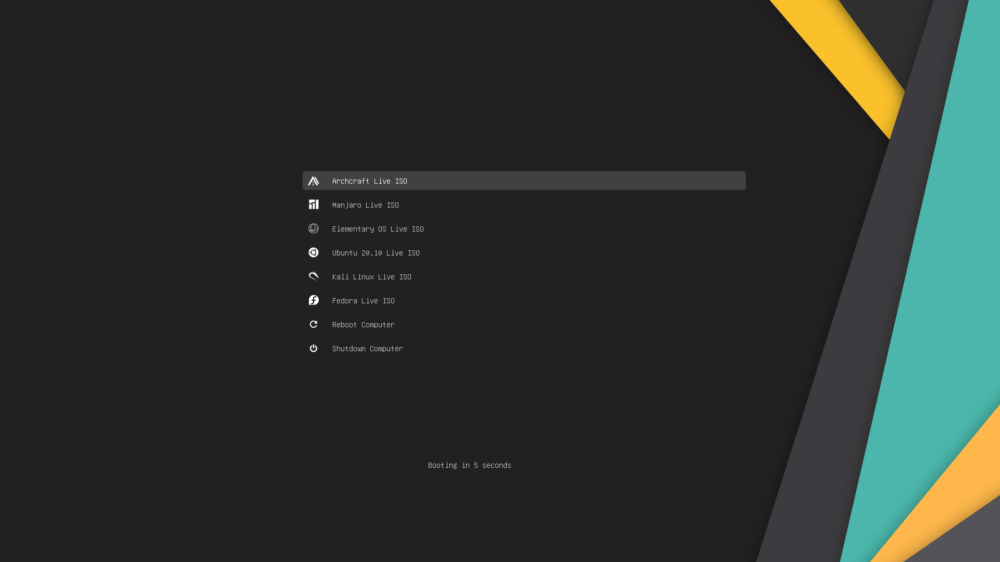
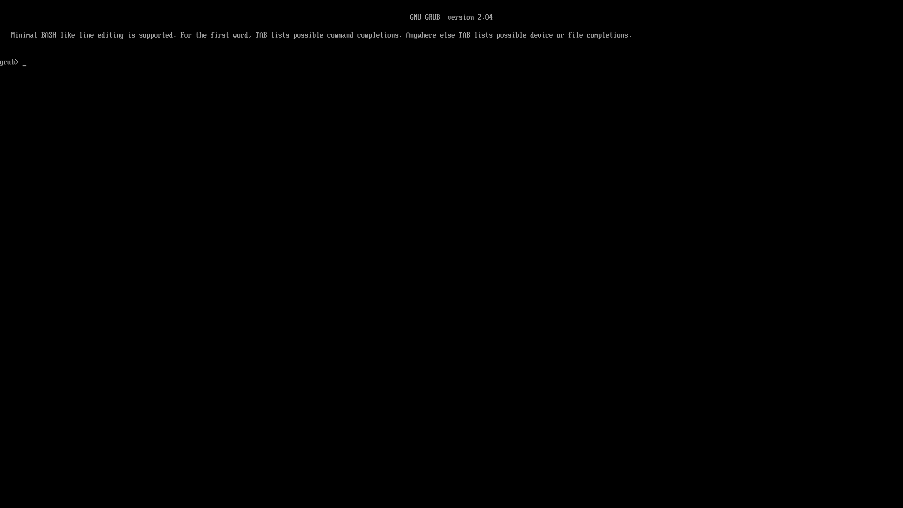
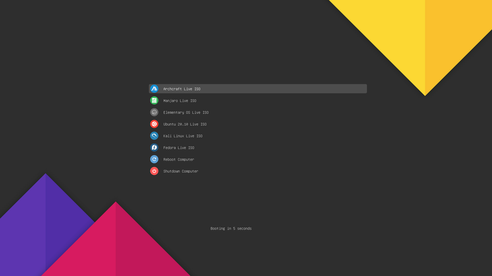
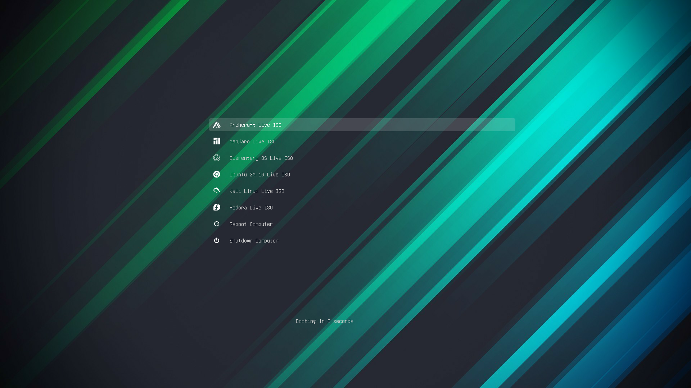
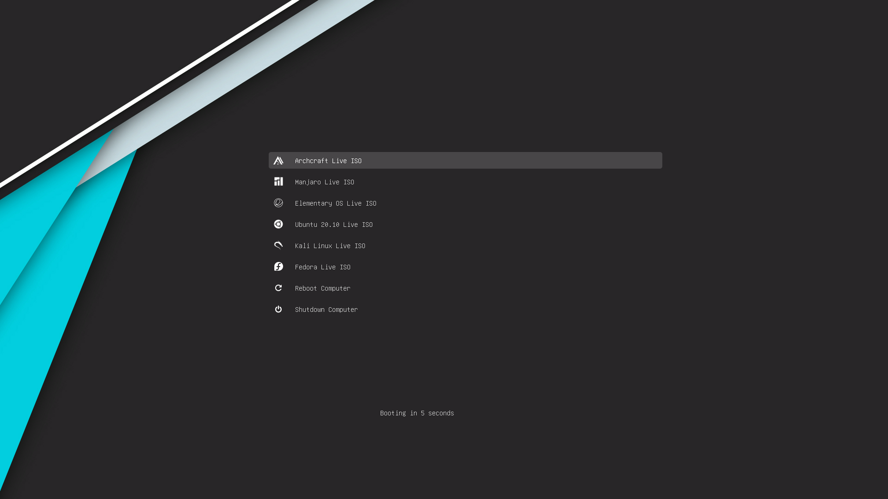

# Multiboot USB Drive With GRUB2 Bootloader

<p align="left">
  <a href="https://github.com/adi1090x/uGRUB#prepare-the-usb-drive" target="_blank"></a>
  <a href="https://github.com/adi1090x/uGRUB#install-grub2-on-the-usb-flash-drive" target="_blank"></a>
  <a href="https://github.com/adi1090x/uGRUB#configuration" target="_blank"></a>
  <a href="https://github.com/adi1090x/uGRUB#menu-entries" target="_blank"></a>
  <a href="https://github.com/adi1090x/uGRUB#changing-themes" target="_blank"></a>
</p>


The ultimate guide to install and configure `grub2` bootloader on USB Flash Drive to boot multiple ISO files.



It's a headache to format your USB again and again just to try out a new Linux distribution or when you want to install another distribution, **DistroHoppers** can feel the pain. This guide may help you with that situation. In this guide, I'm trying to explain how you can install and configure grub2 bootloader on an USB thumb drive and then boot multiple Linux ISOs with it. So, follow this guide if you want to create one. I'll also tell you how you can boot the Linux ISO from an installed Linux OS later in this guide.

## Prepare the USB drive

You need to boot into a Linux based operating system for this. I'm assuming that you've already done that. If not, first boot into a Linux environment (eg: Ubuntu live cd). I'm using ***Arch Linux*** here to perform these operations. Now follow the steps below :

**1.** Insert your USB Flash Drive and find out your USB. Open the terminal and enter the `lsblk` command...
```
$ lsblk
NAME        MAJ:MIN RM   SIZE RO TYPE MOUNTPOINT
sda           8:0    1  29.3G  0 disk 
└─sda1        8:1    1  29.2G  0 part 
nvme0n1     259:0    0 238.5G  0 disk 
├─nvme0n1p1 259:1    0   100M  0 part /boot
├─nvme0n1p2 259:2    0    16M  0 part 
├─nvme0n1p3 259:3    0    80G  0 part 
├─nvme0n1p4 259:4    0 101.8G  0 part 
├─nvme0n1p5 259:5    0    41G  0 part /
├─nvme0n1p6 259:6    0   512M  0 part 
├─nvme0n1p7 259:7    0    14G  0 part 
└─nvme0n1p8 259:8    0     1G  0 part 
```
You'll get similar output. As you can see in the output above, **/dev/sda** is my USB drive. On your system, it may be different (like `/dev/sdb`, `/dev/sdc`). You can recognize your USB by it's size (mine is 32GB). ***Be careful here...***

**2.** Now, to modify disk, we need root access. To gain root, type...
```
$ sudo su
```

**3.** Now format your USB Flash Drive to use a single partition. Open a terminal and type...
```
# fdisk /dev/sdX
```
> Replace **`X`** with your actual usb device (eg: `/dev/sdb`)

* You'll see something similar to this :
```
Welcome to fdisk (util-linux 2.36).
Changes will remain in memory only, until you decide to write them.
Be careful before using the write command.


Command (m for help): 
```
> **`Warning : All the data on the USB drive will be lost here.`**

- Type **`d`** to delete the existing partition (repeat this step if you have multiple partitions)
```
Command (m for help): d
Selected partition 1
Partition 1 has been deleted.
```

- Type **`n`** to create a new partition
```
Command (m for help): n
Partition type
   p   primary (0 primary, 0 extended, 4 free)
   e   extended (container for logical partitions)
```

- Type **`p`** for primary partition
```
Select (default p): p
```

- Type **`1`** to create the first partition
```
Partition number (1-4, default 1): 1
```

- Press **`Enter`** to use the default value as first cylinder
```
First sector (2048-61341695, default 2048): 
```

- Press **`Enter`** again to use the default value as the last cylinder
```
Last sector, +/-sectors or +/-size{K,M,G,T,P} (2048-61341695, default 61341695): 
```
  
- Type **`a`** for mark partition as active (sets bootable flag)
```
Command (m for help): a
Selected partition 1
The bootable flag on partition 1 is enabled now.
```

- Type **`t`** (for partition type) and then Type **`c`** (to use fat32 partition)
```
Command (m for help): t

Selected partition 1
Hex code or alias (type L to list all): c
Changed type of partition 'Linux' to 'W95 FAT32 (LBA)'.
```

- And, Finally... Type **`w`** to write the changes and close `fdisk`
```
Command (m for help): w
The partition table has been altered.
Calling ioctl() to re-read partition table.
Syncing disks.
```


**4.** Now, Let's create a Fat32 Filesystem on the USB Flash Drive...
```
# umount /dev/sdX1

# mkfs.vfat -F 32 -n Multiboot /dev/sdX1
mkfs.fat 4.1 (2017-01-24)
mkfs.fat: warning - lowercase labels might not work properly with DOS or Windows
```
> Ignore `lowercase labels` warnings. Remember to replace **`X`** with your USB device.

## Install Grub2 on the USB Flash Drive

We have successfully prepared our USB Flash Drive to install grub bootloader on it. Now let's install it, follow the steps below carefully. If you use the wrong syntax, you will receive an error stating _"Installation is impossible. Aborting"_ or something similar.

* Mount the partition you've just created on your USB drive
```
# mount /dev/sdX1 /mnt
```

* Now, find out whether the host (system) is booted in `UEFI` or `BIOS` mode. The easiest way is to check to see if `/sys/firmware/efi` exists. If it does not exist, you booted using traditional BIOS.
```
# ls -ld /sys/firmware/efi
drwxr-xr-x 5 root root 0 Nov 14  2020 /sys/firmware/efi
```
As you can see, the directory `/sys/firmware/efi` exists on my system, which means my host is booted into `UEFI` mode. Now install grub accordingly...

**`If Grub2 64 bit UEFI x86_64-efi is installed on the Linux host, then type...`**
```
# grub-install --force --removable --target=x86_64-efi --boot-directory=/mnt/boot --efi-directory=/mnt /dev/sdX
```

**`If Grub2 32 bit UEFI i386-efi is installed on the Linux host, then type...`**
```
# grub-install --force --removable --target=i386-efi --boot-directory=/mnt/boot --efi-directory=/mnt /dev/sdX
```

**`If Grub2 BIOS i386-pc is installed on the Linux host, then type...`**
```
# grub-install --force --removable --target=i386-pc --boot-directory=/mnt/boot /dev/sdX
```

* If you've selected the right options, you'll see `Installation finished.` ie: for me its...
```
Installing for x86_64-efi platform.
Installation finished. No error reported.
```

* You can verify the installation by listing the contents of `/mnt`
```
# ls -l /mnt/boot/grub 
total 80
drwxr-xr-x 2 root root 16384 Nov 13 18:04 fonts
-rwxr-xr-x 1 root root  1024 Nov 13 18:04 grubenv
drwxr-xr-x 3 root root 16384 Nov 13 18:04 themes
drwxr-xr-x 2 root root 32768 Nov 13 18:04 x86_64-efi

# ls -l /mnt/EFI/BOOT 
total 128
-rwxr-xr-x 1 root root 131072 Nov 13 18:04 BOOTX64.EFI
```

* That's it. Grub installed on the USB drive. Unmount the partition...
```
# umount /dev/sdX1
```
> Remember to replace **`X`** with your USB device in the commands above.

Reboot your Computer, and enter your Boot Menu. Set the Boot Order to boot from the USB Device. Save your changes and Reboot. If all goes well, you should be presented with the Grub2 command line interface like this...



## Configuration

Just installing grub bootloader is not enough to boot the ISOs, We've to configure grub to load the bootable files from the ISO. Well Lucky you, I've already done that for you. I've configured grub to have nice themes with distro logo, added a lot of menu entries to boot various ISO files. However, there's a bit of configuration you need to do before you can actually boot an ISO. Follow the steps below to finish the config for you : 

- First, Clone this repository in your home directory
```
$ cd $HOME
$ git clone --depth=1 https://github.com/adi1090x/uGRUB.git
```

- Mount the bootable USB we've created using a file manager to avoid performing further operations as `root`

- Copy everything from `grub` directory of repository to `/boot/grub` in the USB drive
```
$ cd ~/uGRUB
$ cp -rf grub/* /path/to/USB/boot/grub
```
> Replace `path/to/usb` with path your USB mounted on. You can get that with `lsblk` command.

- Get the UUID of your USB drive
```
$ sudo blkid
/dev/sdX1: ... UUID="B17C-FEDA" ...
```

- Now, Edit the `grub.cfg` file you copied on the USB drive using your favorite text editor
```
$ vim /path/to/usb/boot/grub/grub.cfg
```

- Replace every instance of `YOUR_UUID` with the UUID of your USB drive. eg:
```
...
else
  search --no-floppy --fs-uuid --set=root YOUR_UUID
fi
...
```
```
...
else
  search --no-floppy --fs-uuid --set=root B17C-FEDA
fi
...
```

### Menu Entries

Before adding or modifying menu entries in our config file, first we need to understand it's format. Below is a skeleton of a simple grub menu entry - 

```
1  menuentry "TITLE" --class ICON {
2      set root='(hd0,PARTITION)'
3      set isofile="PATH/TO/ISO"
4      loopback loop $isofile
5      linux (loop)/KERNEL iso-scan/filename=${isofile} KERNEL_ARGUMENTS
6      initrd (loop)/MICROCODE (loop)/INITRD
7  }
```

- `Line 1` is the beginning of a menuentry, replace ***TITLE*** and ***ICON*** according to the ISO.
- `Line 2` specifies the root partition, where the bootloader looks for the ISO file.
- `Line 3` is the path of the ISO.
- `Line 4` creates a loopback device for the ISO.
- `Line 5` loads the kernel from the loop, and passes various kernel arguments.
- `Line 6` loads initial ramdisk file and microcode (eg : `amd-ucode.img`) if available.
- `Line 7` ends the menu entry.

**Example Entry** : According to format above, this is the menu entry for Ubuntu ISO...
```
menuentry "Ubuntu 20.04 Live ISO" --class ubuntu --class linux {
    set root='(hd0,1)'
    set isofile="/ubuntu-20.04.1-desktop-amd64.iso"
    loopback loop $isofile
    linux (loop)/casper/vmlinuz boot=casper iso-scan/filename=${isofile} quiet splash vt.global_cursor_default=0 loglevel=2 rd.systemd.show_status=false rd.udev.log-priority=3 sysrq_always_enabled=1 cow_spacesize=1G
    initrd (loop)/casper/initrd
}
```

**`How to find the path of the kernel, initrd and the kernel arguments needed to boot the ISO properly?`**

You can mount the ISO file and look at its contents to get this information. for example, I'm going to mount the Ubuntu ISO and look for kernel, initrd and kernel arguments :

```
$ sudo mount -o loop ubuntu-20.04.1-desktop-amd64.iso /mnt
[sudo] password for aditya:
mount: /mnt: WARNING: source write-protected, mounted read-only.

$ ls -l /mnt
total 93
dr-xr-xr-x 1 root root  2048 Jul 31 22:18 boot
dr-xr-xr-x 1 root root  2048 Jul 31 22:18 casper
dr-xr-xr-x 1 root root  2048 Jul 31 22:17 dists
dr-xr-xr-x 1 root root  2048 Jul 31 22:18 EFI
dr-xr-xr-x 1 root root  2048 Jul 31 22:18 install
dr-xr-xr-x 1 root root 34816 Jul 31 22:18 isolinux
-r--r--r-- 1 root root 42622 Jul 31 22:21 md5sum.txt
dr-xr-xr-x 1 root root  2048 Jul 31 22:17 pics
dr-xr-xr-x 1 root root  2048 Jul 31 22:17 pool
dr-xr-xr-x 1 root root  2048 Jul 31 22:17 preseed
-r--r--r-- 1 root root   231 Jul 31 22:17 README.diskdefines
lr-xr-xr-x 1 root root     1 Jul 31 22:17 ubuntu -> .

$ ls -l /mnt/casper
total 2154482
-r--r--r-- 1 root root      56693 Jul 31 22:13 filesystem.manifest
-r--r--r-- 1 root root       2890 Jul 31 22:13 filesystem.manifest-minimal-remove
-r--r--r-- 1 root root       3839 Jul 31 22:13 filesystem.manifest-remove
-r--r--r-- 1 root root         11 Jul 31 22:13 filesystem.size
-r--r--r-- 1 root root 2103640064 Jul 31 22:13 filesystem.squashfs
-r--r--r-- 1 root root        833 Jul 31 22:16 filesystem.squashfs.gpg
-r--r--r-- 1 root root   90821026 Jul 31 22:13 initrd
-r--r--r-- 1 root root   11662080 Jul 31 22:13 vmlinuz
```

Here, we can see that the kernel is `vmlinuz` and initrd is `initrd`, both in **`casper`** directory. You can look for the kernel arguments the same way, by printing the content of config files in `boot` & `isolinux` directories.
```
$ cat /mnt/boot/grub/loopback.cfg 
menuentry "Ubuntu" {
	set gfxpayload=keep
	linux	/casper/vmlinuz  file=/cdrom/preseed/ubuntu.seed maybe-ubiquity iso-scan/filename=${iso_path} quiet splash ---
	initrd	/casper/initrd
}
menuentry "Test memory" {
	linux16	/install/mt86plus
}
```

Now, let's get back to our config file, there are many entries already added to the config file, but they are commented out with a `!`, you need to uncomment the menu entry before using it for the selected ISO. Replace `/path/to/iso` with the path of your ISO file.

**Available Menu Entries :** `Archcraft OS`, `Arch Linux`, `Antergos`, `BlackArch`, `Manjaro`, `Elementary OS`, `Ubuntu/Kubuntu/Xubuntu`, `Kali Linux`, `Deepin OS`, `Linuxmint`, `Fedora`, `Zorin OS`, `Tiny Core` and Android based OS `Remix OS`, `Phoenix OS`, `Androidx86`.

> Some ISO files don't boot with loopback method, in this case you need to extract the ISO to boot that OS. For example : Androidx86, Puppy Linux, Porteus OS, etc.

## Changing Themes

There are already four themes available for this config, but you can add your own themes if you want. If you want to change between currently installed themes, just replace every instance of previous theme name with new theme name in these lines of config file.
```
...
loadfont ($root)/boot/grub/themes/Stylish/dejavu_32.pf2
loadfont ($root)/boot/grub/themes/Stylish/dejavu_sans_12.pf2
loadfont ($root)/boot/grub/themes/Stylish/dejavu_sans_14.pf2
loadfont ($root)/boot/grub/themes/Stylish/dejavu_sans_16.pf2
loadfont ($root)/boot/grub/themes/Stylish/dejavu_sans_24.pf2
loadfont ($root)/boot/grub/themes/Stylish/dejavu_sans_48.pf2
loadfont ($root)/boot/grub/themes/Stylish/terminus-12.pf2
loadfont ($root)/boot/grub/themes/Stylish/terminus-14.pf2
loadfont ($root)/boot/grub/themes/Stylish/terminus-16.pf2
loadfont ($root)/boot/grub/themes/Stylish/terminus-18.pf2
insmod jpeg
insmod png
set theme=($root)/boot/grub/themes/Stylish/theme.txt
...
```

For example, to use **Tela** theme, replace every instance of `Stylish` with the `Tela`. If you want to use a different theme, make sure you load every font correctly.

|Stylish|Tela|
|--|--|
|||

|Slaze|Vimix|
|--|--|
|||

### Boot ISO from installed Linux OS

Well, Now you know how to add a menu entry to boot an ISO file. You can boot the ISO file the same way from an installed Linux OS. It's helpful when you just want to try out a distro, or when you don't have an USB around or when you want to install the ISO on a USB drive. All you need to do is, Add the menu entry to `/etc/grub.d/40_custom` file and update the grub config file. For Example :

```
$ sudo vim /etc/grub.d/40_custom
```

```
#!/bin/sh
exec tail -n +3 $0
# This file provides an easy way to add custom menu entries.  Simply type the
# menu entries you want to add after this comment.  Be careful not to change
# the 'exec tail' line above.

menuentry 'ISO : Archcraft OS' --class archcraft {
  set root='(hd0,5)'
  set isofile='/home/aditya/ISO/archcraft-2020.10.02-x86_64.iso'
  set imgdevpath='/dev/disk/by-uuid/7b2f8d44-676f-47ae-8f0f-c5245fe19e0e'
  loopback loop $isofile
  linux (loop)/arch/boot/x86_64/vmlinuz-linux archisodevice=/dev/loop0 img_dev=$imgdevpath img_loop=$isofile earlymodules=loop quiet splash vt.global_cursor_default=0 loglevel=2 rd.systemd.show_status=false rd.udev.log-priority=3 sysrq_always_enabled=1 cow_spacesize=1G
  initrd (loop)/arch/boot/amd-ucode.img (loop)/arch/boot/x86_64/archiso.img
}
```

```
$ sudo grub-mkconfig -o /boot/grub/grub.cfg
```

### FYI

- If you manage to boot your favorite Linux ISO or updated a menu entry, You can create a Pull Request to add that menu entry here to help other people.
- Open an issue if you want a menu entry for a specific OS, I may or may not do that but hopefully someone else does.
- Not every menu entry is tested, but you got the idea how to make it work for you.
- That's all, Have Fun.
